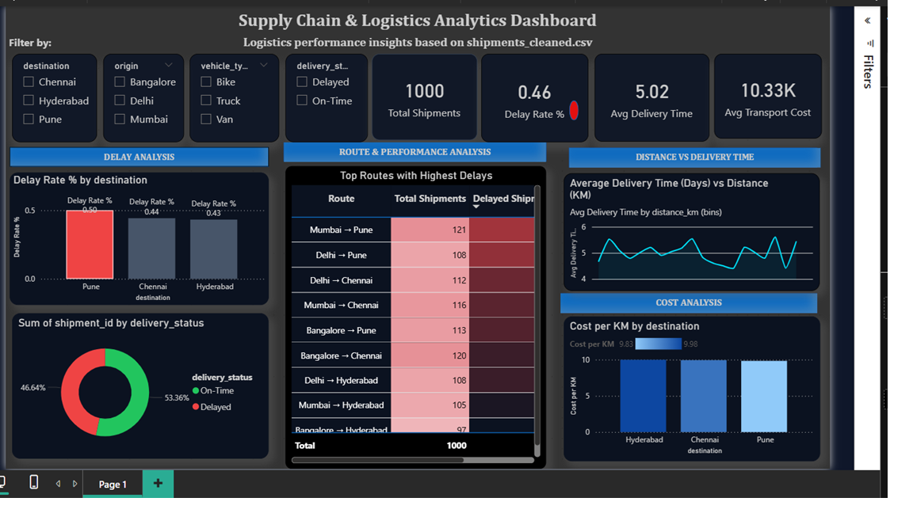

 🚚 Supply Chain & Logistics Analytics Dashboard

 📊 Overview

An interactive **Power BI dashboard** built to analyze logistics performance, identify delay bottlenecks, optimize routes, and monitor transport cost efficiency.

This project enables business users to:
- Track shipment performance
- Identify high-delay routes
- Analyze cost efficiency
- Understand delivery behavior vs distance

 📁 Dataset

- File: `shipments_cleaned.csv`  
- Records: **1,000 shipments**

### Key Fields:
- `shipment_id` — Unique ID  
- `origin` — Source city  
- `destination` — Target city  
- `vehicle_type` — Bike / Truck / Van  
- `distance_km` — Distance  
- `delivery_time_days` — Delivery time  
- `transport_cost` — Cost  
- `delivery_status` — On-Time / Delayed  

 📈 KPI Metrics

- **Total Shipments:** 1,000  
- **Delay Rate:** 46%  
- **Avg Delivery Time:** 5.02 days  
- **Avg Transport Cost:** ₹10.33K  

 📊 Dashboard Sections

🔴 Delay Analysis
- Delay Rate by Destination  
- Pune has highest delay (~50%)

 📊 Route Performance
- Top routes by shipment volume  
- Heatmap highlights high-delay routes  

📉 Distance vs Delivery Time
- No strong correlation  
- Delays are process-driven, not distance-driven  

 💰 Cost Analysis
- Cost per KM ~₹9.8–₹10  
- Minimal variation → pricing likely flat  

 🔍 Key Insights

- Pune = **highest delay region (50%)**
- 46% delays = **systemic issue**
- Distance ≠ cause of delay
- Cost per KM nearly constant
- Mumbai → Pune = high volume + high delay

🚀 How to Run

1. Open Power BI Desktop  
2. Load dataset (`shipments_cleaned.csv`)  
3. Open `.pbix` file  
4. Refresh data  

 📂 Project Structure
